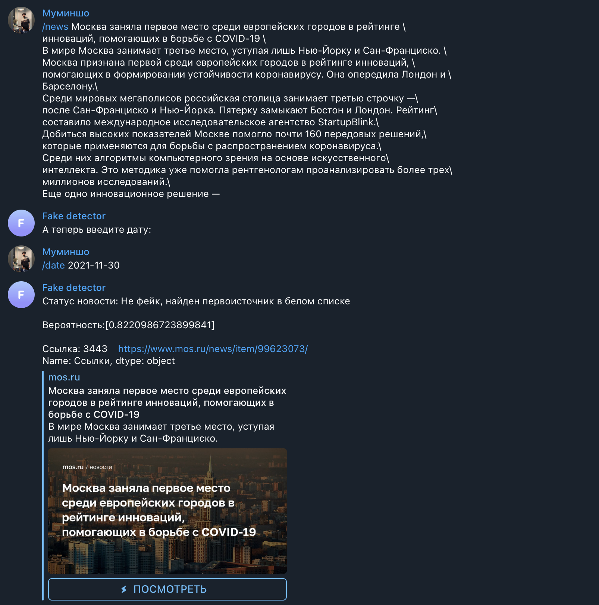

# Moscow_Hack2022
Детекция фэйк новостей

## Телеграм бот, в который вы можете отправить любую новость и получить вероятность отношения этой новости к фейку/не фейку.
### Реализованные задачи:
  * парсинг сайта mos.ru с “белыми” новостями
    * с помощью динамического парсера Selenium было собрано более 5500 новостей за последние 9 месяцев.
  * векторизация полученных данных и первичное сравнение правдивых новостей с новостями из нашего задания(использование zero-shot-classification)
  * написали телеграм-бота с прикрученными к нему моделями для анализа наших данных
### Задачи, которые были реализованы, но не прикручены к боту:
  * генерация фейковых новостей и парсинг с сайта “panorama.pub”(BeautifulSoup) для последующего обучения бинарной классификации с помощью GPT2 на фреймворке PyTorch
  * для новостей, которые первая модель не смогла определить как фейк/правда обучаем логистическую регрессию

